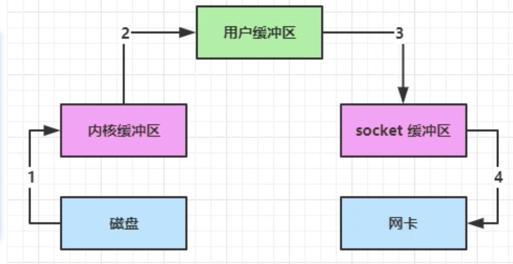

# NIO基础

non-blocking-io：非阻塞IO。

------

## 1. 三大组件

### 1.1 Channel & Buffer

channel有点类似于stream，他就是**读写数据的双向通道**，可以从channel将数据读入buffer，也可以将buffer的数据写入channel。而之前的stream要么是输入，要么是输出，channel比stream更加底层。


常见的buffer有：

- FileChannel
- DatagramChannel
- SocketChannel
- ServerSocketChannel

Buffer则用来缓冲读写数据，常见的Buffer有：

- ByteBuffer
  - MappedByteBuffer
  - DirectByteBuffer
  - HeapByteBuffer
- ShortBuffer
- IntBuffer
- LongBuffer
- FloatBuffer
- DoubleBuffer
- CharBuffer

### 1.2 Selector

**多线程版本服务器**


连接数比较少的时候，如果大批量连接的情况下，会导致服务器内存不够。

- 内存占用高
- 线程上下文切换成本高
- 只适合连接数少的场景

**线程池版本服务器**


- 阻塞模式下，一个线程一次只能处理一个socket
- 仅适合短连接场景

**Selector版本服务器**


selector的作用就是配合一个线程来管理多个channel，获取这些channel上发生的事件，这些channel工作在非阻塞模式下，不会让线程吊死在一个channel上。适合连接数特别多，但流量低的场景。

调用selector的select()方法会阻塞直到channel发生了读写就绪事件，这些事件发生， select方法就会返回这些事件交给thread来处理。

------

## 2. ByteBuffer

有一个普通文件data.txt，使用FileChannel来读取文件内容。

### 2.1 ByteBuffer的正确使用姿势

	1. 向buffer写入数据，调用cahnnel.read(buffer)
	1. 调用buffer.flip()切换到读模式
	1. 从buffer读取数据调用buffer.get()
	1. 调用clear()或者compact()切换到写模式
	1. 重复1～4

### 2.2 ByteBuffer结构

ByteBuffer有下面属性：

- capacity -> 容量
- position -> 写入指针
- limit -> 读写限制

写模式下，postion是写入位置，limit等于容量。


flip动作发生后，position切换为读取位置，limit切换为读取限制。


读取4个字节后，状态：


clear动作发生后，状态：

**compact方法，是把未读完的部分向前压缩，然后切换写模式。**


### 2.3 ByteBuffer常见方法

**分配空间**

```java
ByteBuffer.allocate(16);
// 只能固定的分配空间，如果需要扩容需要重新分配。

// class java.nio.HeapByteBuffer -> java堆内存（受到垃圾回收的影响），读写效率低。
System.out.println(ByteBuffer.allocate(16).getClass());
// class java.nio.DirectByteBuffer -> java直接内存（使用的是系统内存，不会受到垃圾回收的影响。分配内存的效率比较低。），读写效率高。少一次数据的拷贝
System.out.println(ByteBuffer.allocateDirect(16).getClass());
```

**向Buffer写入数据**

- 调用channel的read方法,channel.read(buffer) ->**表示从channel中读取字符写入buffer**
- 调用buffer的put方法

**向Buffer读取数据**

- 调用channel的write方法 -> channel.write(buffer) -> **表示从buffer中读取字符写入channel**
- 调用buffer自己的get方法

get方法会让指针position向后走，如果想重复读取数据

- 调用rewind()将position重新设置为0
- 或者调用get(int i)方法获取索引i的内容，它不会移动指针

**mark和reset**

*mark()* *做一个标记，记录**position**的位置*

*reset()* *将**position**重置到**mark**的位置*

*get(int index)* *这个方法不会改变position位置的方法*

**ByteBuffer和字符串互转**

```java
// 1.字符串转ByteBuffer
ByteBuffer buffer = ByteBuffer.allocate(10);
buffer.put("hello".getBytes());
debugAll(buffer);

// 2.字符串转ByteBuffer --> CharSet 默认将buffer从写模式转为读模式
ByteBuffer buffer1 = StandardCharsets.UTF_8.encode("hello");
debugAll(buffer1);

// 3.wrap
ByteBuffer wrap = ByteBuffer.wrap("hello".getBytes());
debugAll(wrap);

// 1.bytebuffer转string
String string = StandardCharsets.UTF_8.decode(buffer1).toString();
System.out.println(string);
```

**Scattering Reads**

分散读取，有一个文本文件3parts.txt

```txt
onetwothree
```

使用scatteringReads读取，可以将数据填充到多个buffer

```java
try(FileChannel channel = new RandomAccessFile("threeparts.txt","rw").getChannel()) {
            ByteBuffer a = ByteBuffer.allocate(3);
            ByteBuffer b = ByteBuffer.allocate(3);
            ByteBuffer c = ByteBuffer.allocate(5);
            channel.read(new ByteBuffer[]{a,b,c});
            a.flip();
            b.flip();
            c.flip();
            debugAll(a);
            debugAll(b);
            debugAll(c);
        } catch (IOException e) {
            throw new RuntimeException(e);
        }
```

**Gathering Write**

```java
ByteBuffer a = StandardCharsets.UTF_8.encode("hello");
        ByteBuffer b = StandardCharsets.UTF_8.encode("world");
        ByteBuffer c = StandardCharsets.UTF_8.encode("你好");


        try( RandomAccessFile rw = new RandomAccessFile("threeparts2.txt", "rw")) {
            FileChannel channel = rw.getChannel();
            channel.write(new ByteBuffer[]{a,b,c});
        } catch (IOException e) {
            throw new RuntimeException(e);
        }
```

**分散读和集中写可以减少数据在ByteBuffer中的拷贝，这样能达到比较快的速率。**

### 2.4 粘包和半包的问题分析

消息合在一起 -> 粘包，消息被切断了 -> 半包
**粘包的产生原因：**
           发送效率高，导致多条数据合在一起。
 **半包的产生的原因：**
           服务器缓冲区大小限制导致半包的问题。

## 3. 文件编程

### 3.1 FileChannel

>  FileChannel只能工作在阻塞模式下。

**获取**

不能直接打开FileChannel，必须通过FileInputStream、FileOutputStream或者RandomAccessFile来获取FileChannel，他们都有getChannel方法

- 通过FileInputStream获取的Channel只能读
- 通过FileOutputStream获取的Channel只能写
- 通过RandomAccessFile获取的Channel根据构造RandomAccessFile属性来确定

**读取**

会从channel中读取数据填充ByteBuffer，返回值表示读到了多少个字节，-1表示文件末尾

```java
int readBytes = channel.read(buffer);
```

**写入**

```java
ByteBuffer buffer = ...;
buffer.put(...); // 存入数据
buffer.flip(); //切换读模式
while(buffer.hasRemaining()){
  channel.write(buffer);
}
```

在while中调用channel.write是因为write方法并不能保证一次性将buffer中的所有数据写入到channel（channel的写入能力有上线：socketChannel）

**关闭**

channel必须关闭，不过调用FileInputStream、FileOutputStream或者RandomAccessFile的close方法会间接调用channel的close方法

**位置**

获取读取到哪个位置了

```java
long position = channel.position();
```

设置当前位置

```java
long newPos = ...;
channel.position(newPos);
```

设置当前位置时，如果设置为文件末尾

- 这时读取会返回-1
- 这时写入，会追加内容，但注意如果position超过了文件末尾，再写入时在新内容和原末尾之间会有空洞。

**大小**

使用size方法获取文件的大小。

**强制写入**

操作系统为了性能，会将数据缓存，不是立刻写入磁盘，可以调用force(true)方法将文件内容强制立刻写入到磁盘中。

### 3.2 两个Channel传输数据

**TransferTo**

```java
  try (FileChannel from = new FileInputStream("data.txt").getChannel();
       FileChannel to = new FileOutputStream("to.txt").getChannel();
      ) {

            // 效率高，jdk会使用操作系统的零拷贝来进行优化，这个是有上限的，一次最多传2g的数据
            // size代表还剩下多少字节没有传输
            long size = from.size();
            for (long left = size; left > 0; ) {
                left -= from.transferTo(size - left, left, to);
            }
        } catch (IOException e) {
            e.printStackTrace();
        }
```

### 3.3 Path

path拿到文件的地址，file拿到文件实体

Files类里面有很多对文件操作的静态方法，Path是一个地址对象。

***walkFileTree*可以用来遍历文件夹和文件，用来执行相应的操作。**

```java
public static Path walkFileTree(Path start, FileVisitor<? super Path> visitor)
```

**walk可以返回一个流使用流编程方式来处理。**

```java
public static Stream<Path> walk(Path start, FileVisitOption... options) throws IOException 
```

## 4.网络编程

### 4.1 阻塞VS非阻塞

**阻塞**

- 在没有数据可读的时候，包括数据复制过程中，线程必须阻塞等待，不会占用cpu，但线程相当于闲置。
- 32位jvm一个线程320k，64位jvm一个线程1024k，为了减少线程数，需要采用线程池的技术
- 但即便使用了线程池，如果有很多连接创建，长时间active，会阻塞线程池中的所有线程。

**非阻塞**

- 非阻塞模式下，相关方法都会不会让线程暂停
  * 在 ServerSocketChannel.accept 在没有连接建立时，会返回 null，继续运行
  * SocketChannel.read 在没有数据可读时，会返回 0，但线程不必阻塞，可以去执行其它 SocketChannel 的 read 或是去执行 ServerSocketChannel.accept 
  * **写数据时，线程只是等待数据写入 Channel 即可，无需等 Channel 通过网络把数据发送出去**
- 但非阻塞模式下，即使没有连接建立，和可读数据，线程仍然在不断运行，白白浪费了 cpu
- 数据复制过程中，线程实际还是阻塞的（AIO 改进的地方）

**多路复用**

单线程可以配合 Selector 完成对多个 Channel 可读写事件的监控，这称之为多路复用

* **多路复用仅针对网络 IO、普通文件 IO 没法利用多路复用**
* 如果不用 Selector 的非阻塞模式，线程大部分时间都在做无用功，而 Selector 能够保证
  * **有可连接事件时才去连接**
  * **有可读事件才去读取**
  * **有可写事件才去写入**
    * **限于网络传输能力，Channel 未必时时可写，一旦 Channel 可写，会触发 Selector 的可写事件**

**好处**

* 一个线程配合 selector 就可以监控多个 channel 的事件，事件发生线程才去处理。避免非阻塞模式下所做无用功
* 让这个线程能够被充分利用
* 节约了线程的数量
* 减少了线程上下文切换

**绑定 Channel 事件**

```java
channel.configurationBlocking(false);
SelectionKey key = channel.register(selector,绑定事件的操作);
```

- channel必须在非阻塞模式
- FileChannel没有非阻塞模式，因此不能配合selector一起使用
- 绑定的时间类型有：
  - connect - 客户端连接成功时触发
  - accept - 服务器端成功连接时触发
  - read - 数据可读入时触发，因为接受能力弱，数据暂时不能读入的情况
  - write - 数据可写入事件触发，因为发送能力弱，数据暂时不能写出的情况

**监听Channel事件**

可以通过下面三种方法来监听是否有事件发生，方法的返回值代表有多少channel发生了事件

方法1，阻塞直到绑定事件发生

```java
int count = selector.select();
```

方法2，阻塞直到绑定事件发生，或是超时（时间单位为ms）

```java
int count = selector.select(long timeout);
```

方法3，不会阻塞，也就是不管有没有时间，立刻返回，自己根据返回值检查是否有事件

```java
int count = selector.selectNow();
```

**💡 select 何时不阻塞**

> - 事件发生时
>   - 客户端发起连接请求，会触发accept事件
>   - 客户端发送数据过来，客户端正常、异常关闭时，都会触发read事件，另外如果发送的事件大于buffer缓冲区，会触发多次读取时间
>   - channel可写，会触发write事件
>   - 在linux下nio bug发生时
> - 调用selector.wakeup()
> - 调用selector.close()
> - selector所在线程interrupt

**💡 事件发生后能否不处理**

> 事件发生后，要么处理，要么取消。不能什么都不做，否则下次该时间仍然会触发，这是因为nio底层使用的是水平触发。

**💡 为何read事件之前的事件要 iter.remove()**

> 因为select在事件发生后，就会将相关的key放入selectedKeys集合，但不会在处理完后从selectedKeys集合中移除，需要我们硬编码移除。
>
> - 第一次触发accept，没有移除ssckey
> - 第二次触发sckey的read事件，但selectedKeys集合还有上次的sscKey。导致这次再进入accpet的时候，没有新的客户端连接，导致空指针。

**💡 cancel 的作用**

> cancel会取消掉在selector上的channel，并从keys集合中删除key后续不会再监听这个事件。

**处理消息的边界**


- **一种思路是服务端和客户端之间：**固定消息长度，数据包大小缺点是浪费带宽服务器按预定长度读取。
- **另一种思路是按分隔符拆分**，缺点是效率低
- TLV 格式，即 Type 类型、Length 长度、Value 数据，类型和长度已知的情况下，就可以方便获取消息大小分配合适的 buffer，缺点是 buffer 需要提前分配，如果内容过大，则影响 server 吞吐量。
  - Http1.1是TLV格式
  - Http2.0是LTV格式


**ByteBuffer 大小分配**

- 每个channel都需要记录可能被切分的消息，**因为ByteBuffer不能被多个channel共同使用**，因此需要为每个channel维护一个独立的ByteBuffer
- ByteBuffer不能太大，不如说一个ByteBuffer 1Mb的话，要支持百万连接就要1Tb内存。
  - 一种思路是先分配一个小的buffer，例如4K，如果发现数据不够，再分配8k的buffer，将4kbuffer内容拷贝至8k的buffer，优点是消息能够连续处理，缺点是数据拷贝耗费性能。
  - 另一种思路是用多个数组组成buffer，一个数组不够，把多出来的内容写入新的数组，与前面的区别是存储不连续解析复杂，优点是避免了拷贝引起的性能消耗。

## 4.2 更进一步

**利用多线程优化**

> 现在都是多核CPU，设计时要充分利用多核CPU

分两组选择器

- 单线程配一个选择器，专门处理accept时间
- 创建cpu核心数的线程，每个线程配一个选择器，轮流处理read事件

💡 如何拿到 cpu 个数
* Runtime.getRuntime().availableProcessors() 如果工作在 docker 容器下，因为容器不是物理隔离的，会拿到物理 cpu 个数，而不是容器申请时的个数
* 这个问题直到 jdk 10 才修复，使用 jvm 参数 UseContainerSupport 配置， 默认开启

# 5 NIO vs BIO
## 5.1 Stream vs Channel
* stream 不会自动缓冲数据，channel 会利用系统提供的发送缓冲区、接收缓冲区（更为底层）
* stream 仅支持阻塞 API，channel 同时支持阻塞、非阻塞 API，网络 channel 可配合 selector 实现多路复用
* 二者均为全双工，即读写可以同时进行

## 5.2 IO模型
同步阻塞、同步非阻塞、同步多路复用、异步阻塞（没有此情况）、异步非阻塞

* 同步：线程自己去获取结果（一个线程）
* 异步：线程自己不去获取结果，而是由其它线程送结果（至少两个线程）

当调用一次channel.read或者stream.read后，会切换至操作系统内核态来进行数据读取，读取分为两个阶段：

- 等待数据阶段
- 复制数据阶段

- 阻塞IO
- 非阻塞IO
- 多路复用
- 信号驱动
- 异步IO

## 5.3 零拷贝
传统的 IO 将一个文件通过 socket 写出

```java
File f = new File("helloword/data.txt");
RandomAccessFile file = new RandomAccessFile(file, "r");

byte[] buf = new byte[(int)f.length()];
file.read(buf);

Socket socket = ...;
socket.getOutputStream().write(buf);
```

内部工作流程是这样的：


1. Java 本身并不具备 IO 读写能力，因此 read 方法调用后，要从 java 程序的**用户态**切换至**内核态**，去调用操作系统（Kernel）的读能力，将数据读入**内核缓冲区**。这期间用户线程阻塞，操作系统使用 DMA（Direct Memory Access）来实现文件读，其间也不会使用 cpu。

   > DMA 也可以理解为硬件单元，用来解放 cpu 完成文件 IO

2. 从**内核态**切换回**用户态**，将数据从**内核缓冲区**读入**用户缓冲区**（即 byte[] buf），这期间 cpu 会参与拷贝，无法利用 DMA

3. 调用 write 方法，这时将数据从**用户缓冲区**（byte[] buf）写入 **socket 缓冲区**，cpu 会参与拷贝

4. 接下来要向网卡写数据，这项能力 java 又不具备，因此又得从**用户态**切换至**内核态**，调用操作系统的写能力，使用 DMA 将 **socket 缓冲区**的数据写入网卡，不会使用 cpu

可以看到中间环节较多，java 的 IO 实际不是物理设备级别的读写，而是缓存的复制，底层的真正读写是操作系统来完成的

- 用户态与内核态的切换发生了 3 次，这个操作比较重量级
- 数据拷贝了共 4 次

**NIO优化**
通过 DirectByteBuffer

* ByteBuffer.allocate(10)  HeapByteBuffer 使用的还是 java 内存
* ByteBuffer.allocateDirect(10)  DirectByteBuffer 使用的是操作系统内存


大部分步骤与优化前相同，不再赘述。唯有一点：java 可以使用 DirectByteBuf 将堆外内存映射到 jvm 内存中来直接访问使用

* 这块内存不受 jvm 垃圾回收的影响，因此内存地址固定，有助于 IO 读写
* java 中的 DirectByteBufffer 对象仅维护了此内存的虚引用，内存回收分成两步
  * DirectByteBuffer 对象被垃圾回收，将虚引用加入引用队列
  * 通过专门线程访问引用队列，根据虚引用释放堆外内存
* **减少了一次数据拷贝，用户态与内核态的切换次数没有减少**

**进一步优化（linux 2.4）**java中对应着两个cahnnel调用**transferTo/transferFrom**方法拷贝数据


1. java 调用 transferTo 方法后，要从 java 程序的**用户态**切换至**内核态**，使用 DMA将数据读入**内核缓冲区**，不会使用 cpu
2. 数据从**内核缓冲区**传输到 **socket 缓冲区**，cpu 会参与拷贝
3. 最后使用 DMA 将 **socket 缓冲区**的数据写入网卡，不会使用 cpu
4. 可以看到

**只发生了一次用户态与内核态的切换 数据拷贝了3次！**

**再进一步优化**

1. java 调用 transferTo 方法后，要从 java 程序的**用户态**切换至**内核态**，使用 DMA将数据读入**内核缓冲区**，不会使用 cpu
2. 只会将一些 offset 和 length 信息拷入 **socket 缓冲区**，几乎无消耗
3. 使用 DMA 将 **内核缓冲区**的数据写入网卡，不会使用 cpu

**整个过程仅只发生了一次用户态与内核态的切换，数据拷贝了 2 次。**
所谓的【零拷贝】，并不是真正无拷贝，而是在不会拷贝重复数据到 jvm 内存中，零拷贝的优点有：

* 更少的用户态与内核态的切换
* 不利用 cpu 计算，减少 cpu 缓存伪共享
* 零拷贝适合小文件传输

## 5.4 AIO
AIO 用来解决数据复制阶段的阻塞问题

* 同步意味着，在进行读写操作时，线程需要等待结果，还是相当于闲置
* 异步意味着，在进行读写操作时，线程不必等待结果，而是将来由操作系统来通过回调方式由另外的线程来获得结果

>  异步模型需要底层操作系统（Kernel）提供支持
>
>  * Windows 系统通过 IOCP 实现了真正的异步 IO
>  * Linux 系统异步 IO 在 2.6 版本引入，但其底层实现还是用多路复用模拟了异步 IO，性能没有优势

**AIO所启动的线程是一个守护线程在跟操作系统交互，等待操作系统复制数据结束，从而以回调的方式返回。而正因为这是一个守护线程，因此要防止主线程结束导致AIO的线程提前结束。**

## 1.2 为什么需要协议？

TCP/IP 中消息传输基于流的方式，没有边界。

协议的目的就是划定消息的边界，制定通信双方要共同遵守的通信规则

例如：在网络上传输

```
下雨天留客天留我不留
```

是中文一句著名的无标点符号句子，在没有标点符号情况下，这句话有数种拆解方式，而意思却是完全不同，所以常被用作讲述标点符号的重要性

一种解读

```
下雨天留客，天留，我不留
```

另一种解读

```
下雨天，留客天，留我不？留
```


如何设计协议呢？其实就是给网络传输的信息加上“标点符号”。但通过分隔符来断句不是很好，因为分隔符本身如果用于传输，那么必须加以区分。因此，下面一种协议较为常用

``` 
定长字节表示内容长度 + 实际内容
```

例如，假设一个中文字符长度为 3，按照上述协议的规则，发送信息方式如下，就不会被接收方弄错意思了

```
0f下雨天留客06天留09我不留
```

## 1.3 自定义协议要素

* 魔数，用来在第一时间判定是否是无效数据包
* 版本号，可以支持协议的升级
* 序列化算法，消息正文到底采用哪种序列化反序列化方式，可以由此扩展，例如：json、protobuf、hessian、jdk
* 指令类型，是登录、注册、单聊、群聊... 跟业务相关
* 请求序号，为了双工通信，提供异步能力
* 正文长度
* 消息正文

#### 💡 什么时候可以加 @Sharable

* 当 handler 不保存状态时，就可以安全地在多线程下被共享
* 但要注意对于编解码器类，不能继承 ByteToMessageCodec 或 CombinedChannelDuplexHandler 父类，他们的构造方法对 @Sharable 有限制
* 如果能确保编解码器不会保存状态，可以继承 MessageToMessageCodec 父类